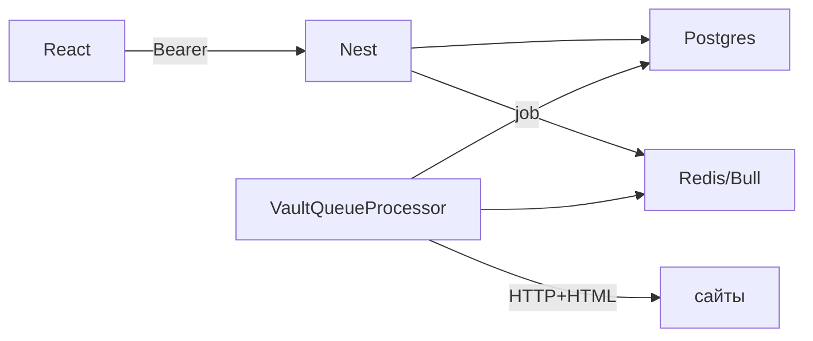

# Research Vault — шпаргалка себе

**Обновлял: 24 апреля 2026**

Пишу это на будущее: через пару месяцев без контекста я сам забуду, где что лежит. Код в репо в основном собран с нейронкой — **это моя карта**, не истина из воздуха. Если сильно поменяю архитектуру, надо **подтянуть дату сверху** и пройтись по разделам.

---

## Зачем вообще этот репо

Свой мини–knowledge base: **ссылки, заметки, файлы, теги, коллекции**. Ссылки и файлы умеют **уезжать в фон** — там парсинг HTML / вытаскивание текста, статусы в `VaultItem`. **OpenAI** — по желанию: саммари, идеи тегов, ответ по выбранным материалам (текст из БД в промпт, **без** отдельной векторки — осознанно MVP).

---

## Как оно крутится (в голове одной картинкой)

| Слой | Что делает |
|------|------------|
| Браузер | React, всё взаимодействие с API. |
| Vite в dev | Крутит фронт, **прокси** `/api` → бэкенд (`apps/web/vite.config.ts`). |
| NestJS | REST, JWT, DTO, Prisma, при желании Swagger. |
| PostgreSQL | Всё персистентное. |
| Redis | Под **Bull** — очередь джоб на обработку ссылок/файлов. |
| Папка на диске | `UPLOAD_DIR` (по умолчанию что-то вроде `uploads/`) — залитые файлы. |

**Цепочка «создал ссылку → подтянулось»** (схема для себя):



---

## Папки (куда смотреть, когда что-то сломалось)

```
apps/api/     — Nest, prisma/schema, очередь, AI
apps/web/     — Vite + React
docs/         — в т.ч. MVP, стек, деплой, этот файл
scripts/      — setup.mjs, первый запуск
docker-compose  — postgres + redis локально
```

Команды с корня — в [README.md](../README.md) (`setup`, `start`, `build`, `db:push`, `db:generate` — что от чего, там же).

---

## Стек: что стоит и зачем мне (кратко)

**Общее:** Node 20+, TypeScript, npm workspaces — два пакета в одном репо, один `package-lock`.

**`apps/api`:** Nest, Prisma, Postgres, `class-validator` (глобальный `ValidationPipe` не пустит левые поля), Swagger если включу `SWAGGER_ENABLED`, Passport-JWT, bcrypt, **Bull + Redis** на фон, axios + cheerio на вытягивание страницы, multer на upload, `openai` — если кину ключ в `.env`.

**`apps/web`:** Vite, React 18, React Router, TanStack Query, где-то RHF + zod (если в формах подключал).

**Дев:** docker-compose под БД/Redis, `concurrently` в корне — поднять api+web разом.

Таблица «только стек» ещё лежит в [STACK.md](./STACK.md) — дублировать смысла нет, там короче.

---

## Модель в БД (смысл)

Всё в `apps/api/prisma/schema.prisma`.

- **User** — логин/пароль (хеш), дальше всё моё.
- **VaultItem** — сущность «материал»: тип (`link` / `note` / `file` / …), контент, файловые поля, **статус обработки**, `extractedText`, `aiSummary`, архив.
- **Tag** + **VaultItemTag** — теги в рамках юзера.
- **Collection** + **CollectionItem** — папки и связь M:N с материалами.

С пользователя вниз — каскады, чистить данные проще.

---

## Бэкенд: что куда смотреть

`app.module.ts` — собрано: конфиг, Bull→Redis, Prisma, auth, vault, теги, коллекции, search, processor (воркер + extract), AI.

**Логин:** `POST /auth/register|login` → `accessToken` + `user`. На фронте токен в **`localStorage`**, ключ **`rv_token`**, смотри `apps/web/src/api/client.ts`. Защита — `JwtAuthGuard`, в стратегии из токена достаю юзера из БД.

**Материалы:** `VaultController` / `VaultService` — список с `q` и фильтрами, создание, upload файла, правки, архив, тег, reprocess. Список и так называемый «поиск» на дашборде — **через `GET /items`**. Отдельно живёт **`GET /search`** (`SearchService`) — по сути тоже `contains` по полям, до 100 строк; **если буду рефакторить поиск, не удивляться, что два входа** — лучше потом схлопнуть или явно развести по смыслу.

**Очередь:** константа очереди в `processor/queue.ts` (например `vault-process`). `VaultQueueProcessor` жрёт `itemId`, `userId`, `kind` = `link` | `file`. Ссылка → `ExtractService` (axios + cheerio). Файл → с диска, текстовые mime читаю, **PDF в коде сейчас заглушка** — не ждать магии.

**AI:** без `OPENAI_API_KEY` в `.env` просто 503. Модель по умолчанию `gpt-4o-mini` или `OPENAI_MODEL`. Саммари пишу в `aiSummary`; `suggest-tags` **не** создаёт теги в БД; `ask` — склейка контекста из выбранных айтемов, без векторного RAG.

---

## Фронт: как я это держу в голове

Роуты в `App.tsx`, приватные обёрткой **`RequireAuth`**, сессия / токен через **`AuthProvider`**, при старте дергаю `/auth/me` если токен есть.

Данные: **`apiFetch`**, обёртки в **`src/api/hooks.ts`**, React Query. Поменял что-то важное — **`invalidateQueries`** с теми же `queryKey`, что у списков.

Стили: **`styles.css`** + классы, иногда **inline** — в этом проекте норм, не бодаться с дизайн-системой, её тут нет.

Подробно про экраны и границы MVP — [MVP.md](./MVP.md).

---

## Env, который реально вспоминать

Шаблоны: **`apps/api/.env.example`**, **`apps/web/.env.example`**.

С ними живу чаще всего: `DATABASE_URL`, `JWT_SECRET` (в бою — нормальный рандом), Redis-хост/порт, `CORS_ORIGIN`, `UPLOAD_DIR`, опционально OpenAI, `SWAGGER_ENABLED` для `/docs`. На web — `VITE_API_BASE` / прокси к API (`VITE_API_PROXY_TARGET` в vite).

---

## Что ковырять, если хочу реально вникнуть (самому себе черновой порядок)

1. TypeScript, async/await, `import type`.
2. HTTP, JWT в заголовке — что я вообще храню в `localStorage`.
3. React + хуки + Router.
4. React Query: `queryKey` и сброс кэша.
5. Nest: модули, guard, DTO, `ValidationPipe`.
6. Prisma: схема и запросы.
7. Почитать про **Bull** и зачем Redis рядом с HTTP.
8. OpenAI chat completions, если пойду копать `AiService`.

Углубление: passport-jwt, multer, cheerio, nginx для прода — [DEPLOY.md](./DEPLOY.md).

---

## Остальная дока

| Файл | Зачем открывать |
|------|-----------------|
| [README.md](../README.md) | Запуск и команды |
| [MVP.md](./MVP.md) | Что в продукте, что нет |
| [STACK.md](./STACK.md) | Сводная таблица стека |
| [DEPLOY.md](./DEPLOY.md) | Куда крутить в проде |

---

## Ограничения, с которыми я сам договаривался (MVP)

Семантики как в векторных базах **нет** — поиск грубый. Файлы **локально**, не S3. PDF/бинарь — **не** полноценный парсер. OpenAI **без** биллинга в UI. Шаринга/мультитенанта **нет** — одна учётка, свои данные.

Дальше — смотрю `vault.service`, `ExtractService` и `AiService`: там вся «магия» и все компромиссы.
