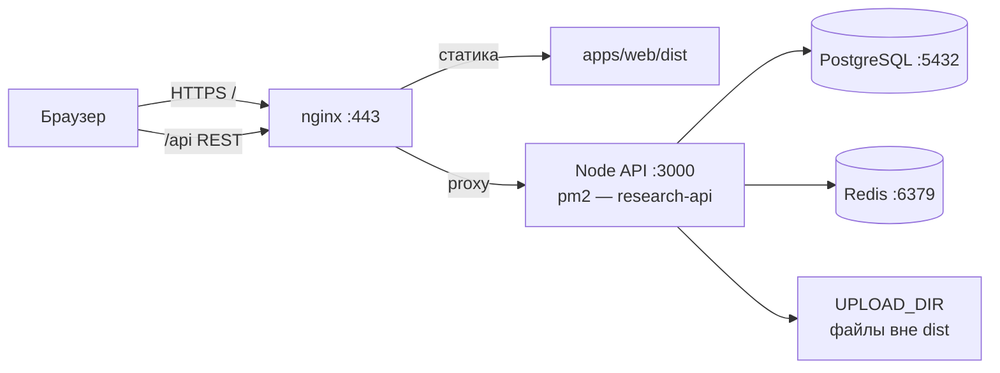

# Research Vault на VPS (Timeweb): что на сервере и как сцеплено

**Назначение:** зафиксировать, как поднят прод на **облачном сервере** (Timeweb Cloud или аналогичный VPS), что установлено и как трафик доходит до приложения. При смене схемы (другой путь, не pm2) обнови этот файл.

**Домен** может быть в «обычном» Timeweb (домены/хостинг), **ВМ** — в **облачной** панели. Это нормально: связь только через **DNS** (**A-запись** → публичный **IP** VPS). Отдельный тариф **виртуального хостинга** ради **этого** Node-приложения не обязателен.

---

## Логика в одной схеме



- **Статика** (React / Vite) — каталог `apps/web/dist` на диске VPS.
- **API** (NestJS) — один процесс **Node** на `127.0.0.1:3000`, обычно под **pm2** (имя вроде `research-api`).
- **PostgreSQL** и **Redis** — локально на сервере (часто пакетами `apt`, без Docker).
- **Загрузки** — `UPLOAD_DIR` в `apps/api/.env` (например `/var/research-vault/uploads`); не клади это в `web/dist`.

*Вариант: только БД/Redis в **Docker** — см. корневой `docker-compose.yml` и [DEPLOY.md](./DEPLOY.md). На prod-VPS не обязателен, если PostgreSQL/Redis поставлены пакетами.*

---

## Что обычно установлено

| Компонент | Зачем |
|-----------|--------|
| **PostgreSQL** (`postgresql`) | База Prisma |
| **redis-server** | Очередь Bull (фон: ссылки, файлы) |
| **Node.js 20+** | `npm run build` и `node dist/main.js` в API |
| **nginx** | Статика `dist` + `proxy` `/api` → бэкенд, TLS после certbot |
| **certbot** (`python3-certbot-nginx`) | Let's Encrypt |
| **pm2** | Процесс API, при желании `pm2 startup` |
| **git** | `git pull` при обновлении |

**systemd (типично):** `nginx`, `postgresql`, `redis-server`. API — **pm2** (или systemd-unit вместо pm2).

---

## Пути (пример: `/opt/research-vault/app`)

| Путь | Роль |
|------|------|
| `/opt/research-vault/app` | Клон репо (путь на своей машине может быть **другим**) |
| `.../app/apps/api/.env` | `DATABASE_URL`, `JWT_SECRET`, `REDIS_*`, `CORS_ORIGIN`, `UPLOAD_DIR`, `PORT` |
| `.../app/apps/api/dist/main.js` | Собранный бэкенд; **его** запускает pm2 |
| `.../app/apps/web/dist` | `npm run build` фронта — **root** в nginx |
| `UPLOAD_DIR` (например `/var/research-vault/uploads`) | Загрузки пользователей |

`apps/api/.env` в git не коммитится — на сервере создаётся вручную по [apps/api/.env.example](../apps/api/.env.example).

---

## Nginx: зачем `location /api/`

- В проде фронт ходит с того же домена, префикс `/api` (`VITE_API_BASE=/api` при сборке).
- В [main.ts](../apps/api/src/main.ts) нет глобального префикса `api` — пути вроде `/auth/login`, `/items/...`.
- В dev Vite **отрезает** `/api` в прокси. В прод nginx делает то же: `location /api/ { proxy_pass http://127.0.0.1:3000/; }` (слэш после `3000/` важен). Пример: [nginx.example.conf](./nginx.example.conf).

---

## Сборка фронта на сервере

Перед `npm run build` из корня клона:

```bash
echo 'VITE_API_BASE=/api' > apps/web/.env.production.local
```

---

## Домен, DNS, HTTPS

1. В панели **DNS** домена: **A** → **публичный IPv4** облачного сервера; при необходимости **A** для `www`.
2. Пока в интернете нет валидной A на этот IP, Let’s Encrypt выдаст ошибку (например **NXDOMAIN** / не пройдёт проверка).
3. `certbot --nginx -d твой-домен` правит nginx под HTTPS.
4. После **HTTPS** `CORS_ORIGIN` в `apps/api/.env` — `https://твой-домен`, затем `pm2 restart research-api`.

---

## Prisma

Если в репо **нет** папки `migrations`, в проде при смене схемы: `cd apps/api && npx prisma db push`. Когда появятся миграции — лучше `npx prisma migrate deploy`.

---

## Обновление кода

Временно до CI/CD: в [README.md](../README.md) смотри раздел **«Прод-деплой»** и **«Обновление кода на сервере»**. Обычно: `git pull` → `npm ci` → `npm run build` → prisma в `apps/api` → `pm2 restart research-api`.

При `divergent branches` на чистом деплой-сервере **без** ценных локальных **коммитов** иногда: `git fetch origin && git reset --hard origin/main` — **сотрёт** трекнутые отличия от `origin/main`; **`.env` чаще не в git** — всё равно проверь `git status`.

---

## Смена пароля PostgreSQL

```bash
sudo -u postgres psql -c "ALTER USER ИМЯ_ПОЛЬЗОВАТЕЛЯ WITH PASSWORD 'ПАРОЛЬ';"
```

Пароль в `DATABASE_URL`, затем `pm2 restart research-api`. Спецсимволы в URL закодируй.

---

## Полезные команды

| Действие | Команда |
|----------|---------|
| Логи API | `pm2 logs research-api` |
| Статус pm2 | `pm2 status` |
| Проверка nginx | `sudo nginx -t` → `sudo systemctl reload nginx` |
| БД / Redis / nginx | `systemctl status postgresql redis-server nginx` |
| Prisma | `cd /путь/к/клону/apps/api && npx prisma ...` |

---

## Первичный выклад (сжатый чек-лист)

1. `systemctl enable --now postgresql redis-server` (если пакетами, без Docker).
2. Создать роль/БД в PostgreSQL, строка `DATABASE_URL` в `apps/api/.env`.
3. Node 20+, `git`, `nginx`; клон в `/opt/research-vault/app` (или свой путь).
4. `apps/api/.env`, `UPLOAD_DIR`, `CORS_ORIGIN` после появления домена/HTTPS.
5. `echo 'VITE_API_BASE=/api' > apps/web/.env.production.local` → `npm ci` → `npm run build`.
6. `cd apps/api && npx prisma generate && npx prisma db push`.
7. `pm2 start dist/main.js` в `apps/api` с `--name research-api`, `pm2 save`, `pm2 startup`.
8. Конфиг `nginx` (см. [nginx.example.conf](./nginx.example.conf)), `server_name` = домен.
9. A-запись в DNS → `certbot --nginx` → снова `CORS` + `pm2 restart` при смене схемы.

---

## См. также

- [README.md](../README.md) — команды, обновление на сервере
- [DEPLOY.md](./DEPLOY.md) — краткий MVP-деплой
- [PROJECT.md](./PROJECT.md) — устройство кода
